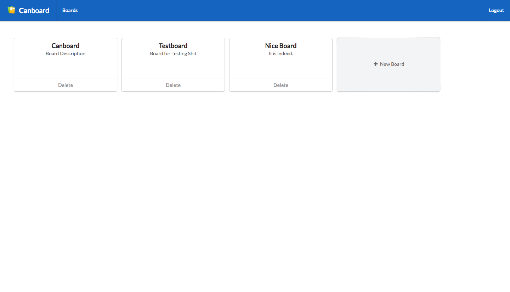

# Canboard Frontend

## Development
- Required Tools: [leiningen](https://leiningen.org/), [sass](http://sass-lang.com/install)
- Compile javascript once: Run `lein devbuild` (compiles for all environments)

For interactive development, there are two options:
* Use one command to compile both sass and clojurescript, using `lein
  sass`, `lein fighweel` and `lein cooper` to combine both. This has
  the alias `lein devloop`.
  Requires [lein-cooper](https://github.com/kouphax/lein-cooper) to be
  added to the users global leiningen configuration.
* Connect `lein figwheel` to the editor of choice using - for
  example -
  [nrepl](https://github.com/bhauman/lein-figwheel/wiki/Using-the-Figwheel-REPL-within-NRepl) for
  more interactive development and compile sass with just `lein sass
  watch` or `sass` directly.
  - *Emacs:* After following the tutorial for `nrepl` with `figwheel`
    linked above, just use `cider-jack-in-clojurescript` or
    `cider-jack-in`, depending on the setup

## Screenshot

